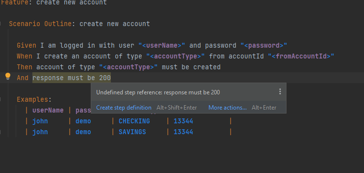
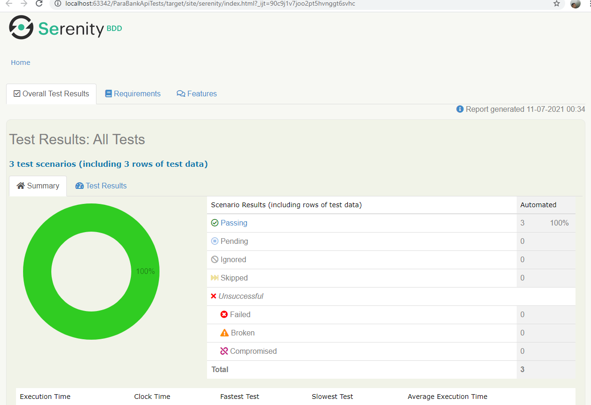
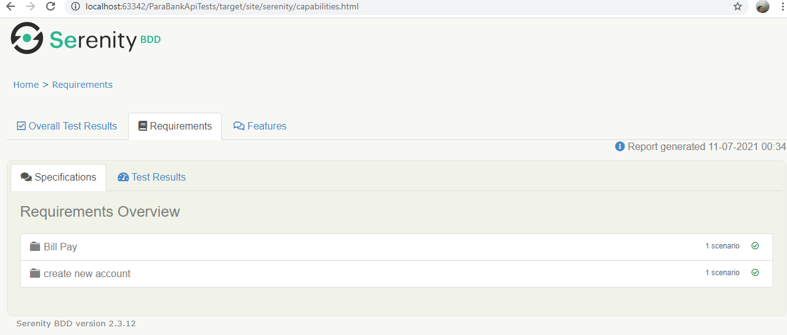
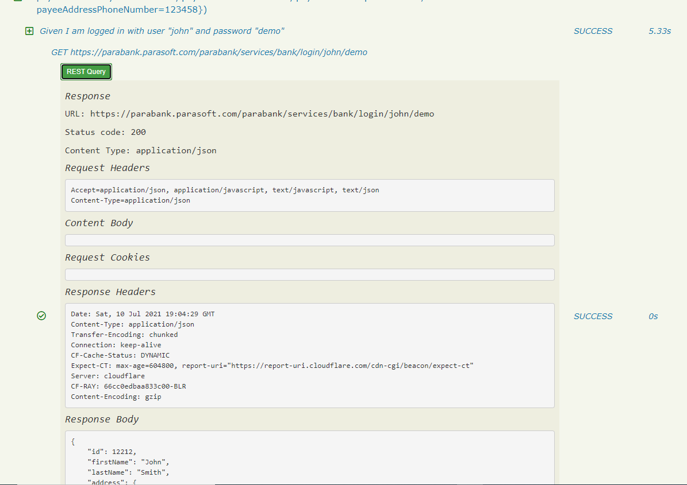

<h3> Para Bank API tests </h3>
<p>
<i><strong>This project contains API tests for ParaBank API services, implemented using Cucumber,Serenity,Rest-Assured and Java</strong></i>
<i><strong>For API documentation overview,refer <a href="api.md">API overview</a> </strong></i>
</p>

### Features
* Gradle setup with Serenity Test runner.
* Test cases written in Gherkin format(Given/When/Then)
* Implement methods for API calls using Serenity-REST Wrapper
* POJO objects to represent requests/models.response
* Utility methods for API models.response validations,extracting JSON data etc.
* Properties file to drive environment test data
* Support for detailed aggregate Serenity-HTML report

### To Get Started
#### Pre-requisites
- Install Java 8.x
- Install Gradle 7.x
- Install IntelliJ or your favourite IDE

#### Project Setup
- Open IntelliJ
- From file menu open project -> select project root folder
- Import from gradle, select auto-import
#### Build
- Once the project is imported successfully through IntelliJ, on the right hand corner you should be able to see the Gradle window.
- Run the Build task from the gradle window to compile and run the cucumber tests.
- You can also run from the command line by navigating to the project folder and running the command 'gradle build'.

#### Writing Features
``` cucumber
Feature: create new account

  Scenario Outline: create new account

    Given I am logged in with user "<userName>" and password "<password>"
    When I create an account of type "<accountType>" from accountId "<fromAccountId>"
    Then account of type "<accountType>" must be created

    Examples:
      | userName | password | accountType | fromAccountId |
      | john     | demo     | CHECKING    | 13344         |
      | john     | demo     | SAVINGS     | 13344         |
      
 ```
#### Writing Step Definitions
To generate step definitions from IntelliJ,
Go To -> Feature file editor, use create step definition option to generate the definition




### Reports
The Serenity reporting plugin is integrated with Gradle and generates a report named index.html.
The report gives a complete overview of the test results including Request/Response logging.





